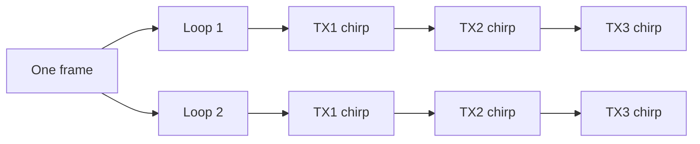
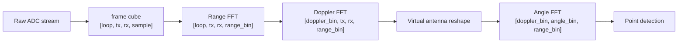

# FMCW Radar

FMCW means `Frequency-Modulated Continuous Wave`. Instead of sending one short pulse, the radar transmits a continuous signal whose frequency changes over time. One such sweep is called a `chirp`.

The received echo is delayed because it traveled to the target and back. When the radar mixes the transmitted signal with the received signal, it obtains a frequency difference called the `beat frequency`.

## Range, Velocity, and Angle

The farther the target is, the larger the delay. Since the chirp frequency is changing over time, a larger delay creates a larger beat frequency.

```text
range = c * beat_frequency / (2 * slope)
```

Velocity is estimated across multiple chirps. Moving targets create phase changes along the slow-time dimension, so Doppler FFT can recover velocity-related components.

Angle is estimated across virtual antennas. TX/RX channels form an antenna array, and phase differences across that array reveal direction.

The project code follows this chain:

```text
range_fft(frame_cube)
-> doppler_fft(range_cube)
-> angle_fft(doppler_cube)
```

## What TX and RX Mean

`TX` means transmit antenna. `RX` means receive antenna. TX antennas send chirps; RX antennas receive reflections from people, desks, walls, and other objects.

With 3 TX and 4 RX antennas, the radar can form:

```text
3 * 4 = 12 TX/RX channels
```

In TDM-MIMO, TX antennas transmit in turn rather than all at once:



Each chirp is received by all RX antennas, so one frame can be reshaped as:

```text
[loop, tx, rx, sample]
```

The `angle_fft` implementation flattens TX/RX into virtual antennas:

```text
[doppler_bin, tx, rx, range_bin]
-> [doppler_bin, virtual_antennas, range_bin]
```

The order matters. Angle estimation depends on the phase relationship across the antenna array, so strict reproduction should use calibrated virtual antenna geometry.


