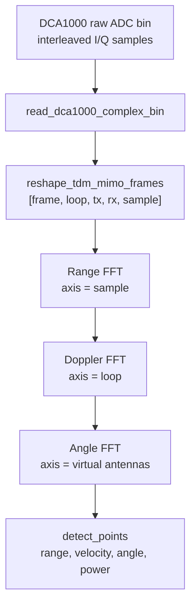

# ADC to Radar Cube

Raw ADC data is a stream of complex samples. It is not a point cloud and not an image. The first task is to reshape it into a frame structure that FFT processing can use.

[`radar_fft_cube_progress_en.ipynb`](https://github.com/billzi2016/mmlock-fmcw-radar-deep-security/blob/main/radar_fft_cube_progress_en.ipynb) uses this path. The aligned Chinese version is [`radar_fft_cube_progress_zh.ipynb`](https://github.com/billzi2016/mmlock-fmcw-radar-deep-security/blob/main/radar_fft_cube_progress_zh.ipynb).

```text
read_dca1000_complex_bin
-> reshape_tdm_mimo_frames
-> range_fft
-> doppler_fft
-> angle_fft
-> detect_points_from_angle_cube
```

The parallel implementation splits this into `dca1000_reader.py`, `fft_layers.py`, `point_cloud.py`, and `parallel_pipeline.py`.

## Dimensions

| Dimension | Meaning | Used by |
| --- | --- | --- |
| sample | ADC samples inside one chirp | Range FFT |
| loop / chirp | repeated chirps inside one frame | Doppler FFT |
| TX / RX | antenna channels | virtual antenna array |
| frame | time sequence | behavior modeling |

After Angle FFT, the cube is organized as:

```text
[doppler_bin, angle_bin, range_bin]
```

## TX/RX Ordering

Raw ADC files are usually stored as a time-ordered stream, not as a clean tensor. The processing code needs radar configuration to recover:

```text
[num_loops_per_frame, num_tx, num_rx, num_adc_samples]
```

In TDM-MIMO, TX antennas transmit one by one, and all RX antennas receive each chirp. If TX/RX ordering is wrong, range energy may still appear, but angle estimation will be unreliable because Angle FFT depends on phase relationships across the antenna array.


