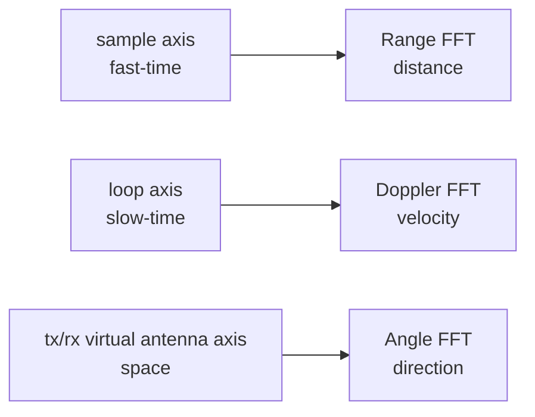

# FFT Pipeline

FFT converts sampled signals into frequency components. In FMCW radar, different dimensions reveal range, velocity, and angle.

The implementation in `radar_fft_cube_progress_parallel/src/fft_layers.py` has three stages.

## Range FFT

Range FFT runs along the fast-time sample dimension:

```text
[loop, tx, rx, sample] -> [loop, tx, rx, range_bin]
```

The beat frequency appears in this dimension, so range bins can be converted into meters.

## Doppler FFT

Doppler FFT runs along the loop dimension:

```text
[loop, tx, rx, range_bin] -> [doppler_bin, tx, rx, range_bin]
```

This captures phase changes across chirps and estimates radial velocity.

## Angle FFT

Angle FFT flattens TX/RX into virtual antennas:

```text
[doppler_bin, tx, rx, range_bin] -> [doppler_bin, angle_bin, range_bin]
```

The output is used by point detection. The current detector uses median noise floor, a dB threshold, and top-K pruning. It is explainable for preprocessing; stricter reproduction can replace it with CFAR.

## Do Not Treat the Three FFTs as One Step



All three stages use FFT, but they operate on different axes and have different physical meanings. Range FFT uses beat frequency, Doppler FFT uses phase changes across chirps, and Angle FFT uses phase differences across virtual antennas.
