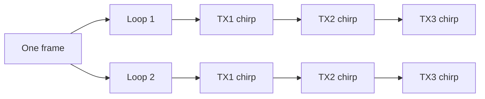
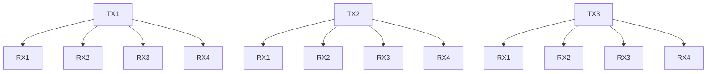
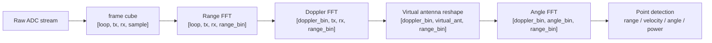

# FMCW 雷达

FMCW 是 `Frequency-Modulated Continuous Wave`，意思是频率调制连续波。它不只是发一个短脉冲，而是持续发射一段频率随时间变化的信号，这段信号通常叫 `chirp`。

可以把 chirp 想成一段“频率坡道”：开始频率较低，随后按固定斜率升高。目标反射回来的信号会比当前发射信号晚一点到达。雷达把发射信号和接收信号混频后，会得到一个频率差，这个差叫 `beat frequency`。

## 距离来自频率差

目标越远，回波延迟越大。因为发射信号的频率一直在爬坡，延迟越大，接收信号和当前发射信号之间的频率差也越大。

简化关系可以写成：

```text
range = c * beat_frequency / (2 * slope)
```

这里 `c` 是光速，`slope` 是 chirp 的扫频斜率。分母里的 `2` 来自往返路径：信号从雷达到目标再回来，走了两倍距离。

## 速度来自多个 chirp 之间的变化

一次 chirp 可以提供距离线索，但速度需要看连续 chirp。运动目标会让回波相位在慢时间维度上产生规律变化。沿 chirp 维度做 Doppler FFT，就能把这种变化转成速度相关的频率分量。

这也是为什么 radar 数据通常不是一维数组。它至少会包含：

- fast-time：一个 chirp 内的 ADC sample，用于 Range FFT。
- slow-time：一帧内连续 chirp 或 loop，用于 Doppler FFT。
- channel：多个 RX/TX 组合形成的天线通道，用于角度估计。

## 角度来自天线阵列

多个接收天线排成阵列时，同一个目标的回波到达各天线会有相位差。沿虚拟天线维度做 Angle FFT，或者使用更细的阵列处理算法，就能估计目标方向。

仓库里的 `radar_fft_cube_progress_parallel/src/fft_layers.py` 用了一个直接的三步流程：

```text
range_fft(frame_cube)
-> doppler_fft(range_cube)
-> angle_fft(doppler_cube)
```

这三步正好对应距离、速度和方向。后续点云检测会在这个三维频域结构上找能量较强的候选点。

## TX、RX 是什么

`TX` 是 transmit antenna，发射天线。`RX` 是 receive antenna，接收天线。

一套毫米波雷达板上通常有多个 TX 和多个 RX。TX 负责把 chirp 发出去，RX 负责接收人体、桌面、墙面反射回来的信号。一个 TX 和一个 RX 的组合可以看成一条收发通道。

如果有 3 个 TX、4 个 RX，理论上能形成：

```text
3 * 4 = 12 条 TX/RX 通道
```

这些通道不是随便堆起来的。它们在空间中有不同位置，所以同一个目标的回波到达各通道时，相位会不一样。这个相位差就是角度估计的来源。

## TDM-MIMO 是怎么排列的

TDM-MIMO 的意思是 Time-Division Multiplexed MIMO。多个 TX 不同时发，而是按时间轮流发 chirp。这样 RX 收到回波时，系统能知道这次回波对应的是哪个 TX。

一个简化的发射顺序可以画成这样：



每个 chirp 都会被所有 RX 接收。于是一个 frame 可以被整理成：

```text
[loop, tx, rx, sample]
```

这正是仓库代码里 `range_fft` 的输入形状。

## 虚拟天线怎么来

TDM-MIMO 的好处是可以把 TX 和 RX 的组合当成更多“虚拟天线”。如果物理上有 3 个 TX 和 4 个 RX，经过组合后可以得到 12 个 virtual antennas。



代码里的 `angle_fft` 做了这件事：

```python
virtual_cube = doppler_cube.reshape(
    cfg.doppler_fft_size,
    cfg.virtual_antennas,
    cfg.range_fft_size,
)
```

也就是把 `[tx, rx]` 展开成 `virtual_antennas`。这一步的前提是通道顺序要和真实天线几何匹配。当前代码里写得很清楚：这是一个简单展开版本，如果要做严格 IWR6843 方位/俯仰成像，需要换成经过标定的虚拟天线几何顺序。

## 数据维度怎么一路变化



看懂这个图，后面的 notebook 就顺了。`sample` 维度解决距离，`loop` 维度解决速度，`tx/rx` 展开的虚拟天线维度解决方向。

## 和 WiFi CSI 的差别再说清楚一点

WiFi CSI 也有幅度和相位，也能看到人体运动带来的扰动。但 WiFi 的子载波、天线和信道估计是围绕通信设计的。它能做感知，是因为人体改变了通信信道。

FMCW 雷达的 chirp 则是围绕感知设计的。扫频斜率、采样率、chirp 数量、天线阵列都会直接影响距离分辨率、速度分辨率和角度估计。

一个直观对比：

| 问题 | WiFi CSI 常见做法 | FMCW 雷达常见做法 |
| --- | --- | --- |
| 人在哪里 | 从 CSI 模式间接推断 | Range/Angle 结构更直接 |
| 人动得多快 | 从时间扰动中学习 | Doppler 维度直接建模 |
| 数据像什么 | 子载波和天线上的信道序列 | range-Doppler-angle cube 或点云 |
| 工程优势 | 设备常见、部署方便 | 空间解释强、测距测速自然 |
| 工程难点 | 场景泛化、多径复杂 | 硬件成本、标定、点云噪声 |

这也是为什么 mmLock 的论文会强调 high-quality mmWave radar imaging。它不是只要判断“有人动了”，而是要尽量稳定地理解用户离开设备的空间过程。
