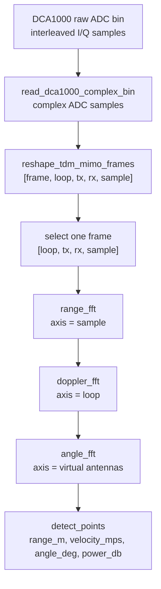

# ADC 到 Radar Cube

雷达前端采到的 raw ADC 数据，本质上是一串复数采样。它还不是点云，也不是图像。要让模型使用，第一步是把这些采样恢复成有物理意义的多维结构。

`radar_fft_cube_progress.ipynb` 中的流程是：

```text
read_dca1000_complex_bin
-> reshape_tdm_mimo_frames
-> range_fft
-> doppler_fft
-> angle_fft
-> detect_points_from_angle_cube
```

并行版本把这些步骤拆到 `radar_fft_cube_progress_parallel/src/`：

- `dca1000_reader.py`：读取 DCA1000 raw ADC bin。
- `fft_layers.py`：执行 Range FFT、Doppler FFT、Angle FFT。
- `point_cloud.py`：把 FFT cube 中的候选峰值转成点。
- `parallel_pipeline.py`：批量处理样本。

## 原始维度

TDM-MIMO 雷达数据常见维度可以这样理解：

| 维度 | 含义 | 后续用途 |
| --- | --- | --- |
| sample | 一个 chirp 内的 ADC 采样点 | Range FFT |
| loop / chirp | 一帧内重复发射的 chirp 序列 | Doppler FFT |
| TX / RX | 发射和接收天线组合 | 虚拟天线阵列 |
| frame | 连续时间上的一帧帧数据 | 行为序列建模 |

`reshape_tdm_mimo_frames` 的意义就是把原本线性排列的 ADC 数据，重排成后续 FFT 能处理的 frame cube。

## TX/RX 通道顺序为什么重要

raw ADC 文件里通常不是直接存成 `[loop, tx, rx, sample]` 这种舒服的形状。采集卡更可能按时间顺序把 I/Q 采样连续写进 bin 文件。后处理要知道雷达配置，才能把线性数据还原成多维数组。

这里最容易糊的是 TX/RX。

- `TX`：发射天线，负责按 chirp 发射调频信号。
- `RX`：接收天线，每个 chirp 发出后，所有 RX 同时接收回波。
- `TDM-MIMO`：多个 TX 轮流发射，系统用时间顺序区分这次回波来自哪个 TX。

一个简化 frame 的排列可以理解为：

```text
frame
└── loop 0
    ├── tx 0 chirp -> rx 0, rx 1, rx 2, rx 3 samples
    ├── tx 1 chirp -> rx 0, rx 1, rx 2, rx 3 samples
    └── tx 2 chirp -> rx 0, rx 1, rx 2, rx 3 samples
└── loop 1
    ├── tx 0 chirp -> rx 0, rx 1, rx 2, rx 3 samples
    ├── tx 1 chirp -> rx 0, rx 1, rx 2, rx 3 samples
    └── tx 2 chirp -> rx 0, rx 1, rx 2, rx 3 samples
```

整理成数组后就是：

```text
[num_loops_per_frame, num_tx, num_rx, num_adc_samples]
```

如果 TX/RX 顺序错了，Range FFT 可能还能看到能量，但 Angle FFT 会乱，因为角度估计依赖天线之间的相位关系。

## 从采样流到 cube 的 Mermaid 图



这张图对应 notebook 里的函数顺序，也对应并行版本的代码拆分。

## Radar Cube 是什么

Radar cube 是一个中间表示。它把原始时域信号变成按距离、速度、角度组织的能量结构。仓库并行版本中，`angle_fft` 的输出形状写得很直接：

```text
[doppler_bin, angle_bin, range_bin]
```

后面的点检测就在这个 cube 上找能量高于阈值的候选点，再把 bin index 换算成米、米每秒和角度。
