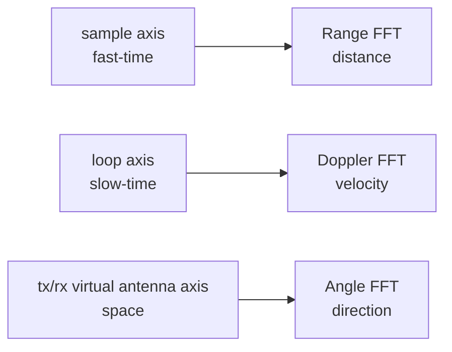

# FFT 处理流程

FFT 的作用是把采样序列拆成频率成分。FMCW 雷达里的距离、速度和角度，都可以通过不同维度上的频率或相位结构估计出来。

## FFT 之前，数据只是混在一起的波

先不要急着看公式。雷达刚采到的数据，本质上是一串随时间变化的数。它像一段录音波形：你能看到波在抖，但很难直接从波形上看出里面有几个声音、每个声音的音高是多少。

FMCW 雷达的 ADC 数据也是这样。一个 chirp 里，接收信号和发射信号混频后得到 IF signal。这个 IF signal 里混着很多反射：

```text
桌面反射 + 人体胸口反射 + 手臂反射 + 椅子反射 + 墙面反射 + 噪声
```

它们叠在一起后，在时域里只是一个复杂波形。直接看这个波形，很难回答“哪个反射来自 1 米，哪个来自 2 米”。

FFT 要做的事，就是把这个混合波形拆开，看里面有哪些频率成分。对 FMCW 来说，不同距离的目标会产生不同 beat frequency，所以拆出频率后，就能把频率映射到距离。


可以把 FFT 理解成一个“频率筛子”。它不是凭空识别人体，而是把原本混在一起的波拆成更容易解释的频率格子。

## 先把 FFT 放回任务里

如果只说“做三次 FFT”，这句话没有信息量。对 mmLock 来说，三次 FFT 分别在回答三个和离开检测有关的问题：

```text
Range FFT：人离设备多远？
Doppler FFT：人体反射是在靠近还是远离？
Angle FFT：反射大概来自哪个方向？
```

用户从椅子上离开时，这三个答案会一起变化。距离可能变大，速度会出现连续变化，角度也可能从设备正前方偏到一侧。模型后面看到的点云，就是这些变化被提取后的结果。

## 三次 FFT 前后发生的变化

如果把整条链路压缩成一句话，就是：

```text
FFT 不是为了装饰数据，而是为了把混在一起的雷达波拆成可解释的距离、速度和方向。
```

三次 FFT 后，数据从“难解释的波形”变成了“带物理意义的格子”：

```text
ADC sample
-> Range FFT
-> 距离格子
-> Doppler FFT
-> 距离 + 速度格子
-> Angle FFT
-> 距离 + 速度 + 方向格子
```

radar cube 的每个格子都可以被解释成：

```text
某个距离、某个速度、某个方向上，有多强的反射能量
```

点云检测再从这个 cube 里挑出能量比较强、比较像人体反射的格子，把它们转换成 `range_m`、`velocity_mps`、`angle_deg`、`power_db`。

仓库的核心实现来自 `radar_fft_cube_progress_parallel/src/fft_layers.py`。

## 1. Range FFT

```python
def range_fft(frame_cube, cfg):
    window = np.hanning(cfg.num_adc_samples)
    windowed = frame_cube * window[None, None, None, :]
    return np.fft.fft(windowed, n=cfg.range_fft_size, axis=-1)
```

输入形状：

```text
[loop, tx, rx, sample]
```

Range FFT 沿 `sample` 维度做。这个维度也叫 fast-time，因为它来自一个 chirp 内的快速 ADC 采样。FMCW 的 beat frequency 就藏在这里，FFT 后的 range bin 可以换算成距离。

可以把它看成把一段混在一起的回波拆开：近处反射落在较小的 range bin，远处反射落在较大的 range bin。桌子、人体、墙都可能有自己的距离峰。

更直观地说：

```text
近处目标 -> 回波延迟小 -> beat frequency 小 -> 较小 range bin
远处目标 -> 回波延迟大 -> beat frequency 大 -> 较大 range bin
```

如果没有 Range FFT，系统看到的只是 ADC 波形；做完 Range FFT，系统至少知道“哪些距离上有明显反射”。

## 2. Doppler FFT

```python
def doppler_fft(range_cube, cfg):
    window = np.hanning(cfg.num_loops_per_frame)
    windowed = range_cube * window[:, None, None, None]
    cube = np.fft.fft(windowed, n=cfg.doppler_fft_size, axis=0)
    return np.fft.fftshift(cube, axes=0)
```

输入形状：

```text
[loop, tx, rx, range_bin]
```

Doppler FFT 沿 `loop` 维度做。这个维度也叫 slow-time，因为它看的是多个 chirp 之间的相位变化。目标靠近或远离时，这个维度会出现规律变化，FFT 后得到 Doppler bin。

如果人体静止，Doppler 接近 0；如果用户起身或走开，人体反射会在 Doppler 维度上出现非零速度成分。这个维度对“离开”这种动作很关键，因为离开不是静态位置，而是一段移动过程。

这一步对 mmLock 很关键。因为“坐着的人”和“正在离开的人”可能在某一瞬间都出现在类似距离上，但它们的速度模式不同。离开是动态过程，不是单帧位置。

## 3. Angle FFT

```python
def angle_fft(doppler_cube, cfg):
    virtual_cube = doppler_cube.reshape(
        cfg.doppler_fft_size,
        cfg.virtual_antennas,
        cfg.range_fft_size,
    )
    window = np.hanning(cfg.virtual_antennas)
    windowed = virtual_cube * window[None, :, None]
    cube = np.fft.fft(windowed, n=cfg.angle_fft_size, axis=1)
    return np.fft.fftshift(cube, axes=1)
```

输入形状：

```text
[doppler_bin, tx, rx, range_bin]
```

Angle FFT 会先把 TX/RX 展开成虚拟天线阵列，再沿天线维度处理。这样做能从空间相位差里估计方向。

角度估计让系统不只知道“有东西在 1 米外”，还能知道它大概在雷达正前方、左侧还是右侧。附近攻击者场景里，这个方向信息尤其重要，因为系统需要区分目标用户和其他人的反射。

如果只有一个接收通道，雷达知道某个距离上有反射，但很难知道反射来自左边还是右边。多个 TX/RX 通道形成虚拟天线阵列后，同一个目标到不同天线的路径长度略有差异，相位也略有差异。Angle FFT 就是在虚拟天线维度上处理这些相位差。

## 窗口函数

三个 FFT 前都用了 Hann window。窗口函数的作用是降低频谱泄漏：真实目标不一定刚好落在某个离散 bin 中，如果直接 FFT，能量会扩散到旁边的 bin。窗口会让频谱形状更稳定，代价是主瓣会变宽一些。

## 从 cube 到点

`point_cloud.py` 中的 `detect_points` 用了一个解释性很强的策略：

```text
power -> dB -> 有效距离范围 -> median noise floor + threshold -> top-K
```

它不是最终论文级检测器，但适合做批处理预处理和教学说明。后续如果要严格复现实验，可以替换为 CA-CFAR 或 OS-CFAR。

## 三个 FFT 的分工

三个 FFT 都叫 FFT，但处理的维度完全不同。把它们混在一起说，会让后面的点云和模型都变成黑箱。



Range FFT 看的是一个 chirp 内频率差；Doppler FFT 看的是多个 chirp 之间的相位变化；Angle FFT 看的是不同天线通道之间的相位差。它们都用 FFT，只是物理含义不同。

## TX/RX 展开后的角度维

Angle FFT 前，代码把 `tx` 和 `rx` 展开：

```text
[doppler_bin, tx, rx, range_bin]
-> [doppler_bin, virtual_antennas, range_bin]
```

这不是单纯为了改 shape。`virtual_antennas` 代表空间阵列。阵列里的通道顺序决定了相位差如何对应角度。如果通道顺序和实际天线位置不一致，角度图会偏，点云的方向也会偏。

## 代码和模拟器入口

理解 FFT 最稳的方式是同时看两类代码：

- 真实数据处理：[mmwave-fmcw-cascade-mimo-sensing-platform](https://github.com/billzi2016/mmwave-fmcw-cascade-mimo-sensing-platform)
- MIMO FMCW 模拟器：[MIMO-FMCW-Radar-Simulator-Multiprocess](https://github.com/billzi2016/MIMO-FMCW-Radar-Simulator-Multiprocess)

真实数据处理平台更接近工程落地：数据来自采集设备，噪声、标定、通道顺序、文件格式都会影响结果。模拟器更适合科普和调试：你可以控制目标位置、速度、天线参数，再观察 Range FFT、Doppler FFT、Angle FFT 为什么会产生对应变化。
