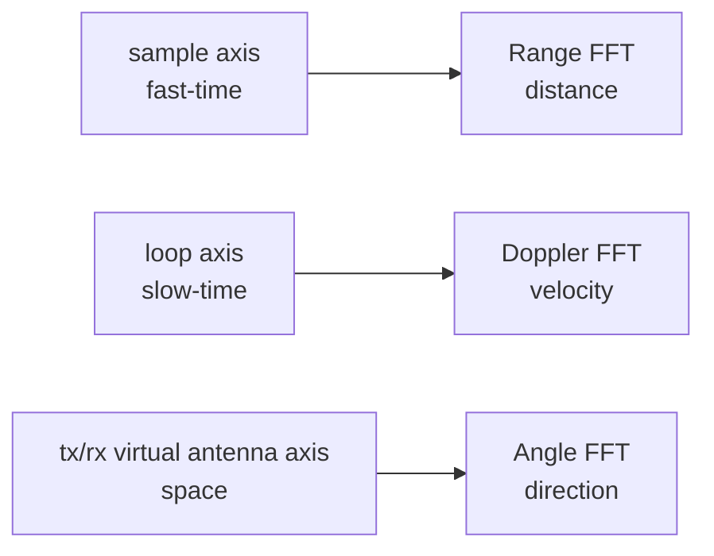

# FFT 处理流程

FFT 的作用是把采样序列拆成频率成分。FMCW 雷达里的距离、速度和角度，都可以通过不同维度上的频率或相位结构估计出来。

仓库的核心实现来自 `radar_fft_cube_progress_parallel/src/fft_layers.py`。

## 1. Range FFT

```python
def range_fft(frame_cube, cfg):
    window = np.hanning(cfg.num_adc_samples)
    windowed = frame_cube * window[None, None, None, :]
    return np.fft.fft(windowed, n=cfg.range_fft_size, axis=-1)
```

输入形状：

```text
[loop, tx, rx, sample]
```

Range FFT 沿 `sample` 维度做。这个维度也叫 fast-time，因为它来自一个 chirp 内的快速 ADC 采样。FMCW 的 beat frequency 就藏在这里，FFT 后的 range bin 可以换算成距离。

## 2. Doppler FFT

```python
def doppler_fft(range_cube, cfg):
    window = np.hanning(cfg.num_loops_per_frame)
    windowed = range_cube * window[:, None, None, None]
    cube = np.fft.fft(windowed, n=cfg.doppler_fft_size, axis=0)
    return np.fft.fftshift(cube, axes=0)
```

输入形状：

```text
[loop, tx, rx, range_bin]
```

Doppler FFT 沿 `loop` 维度做。这个维度也叫 slow-time，因为它看的是多个 chirp 之间的相位变化。目标靠近或远离时，这个维度会出现规律变化，FFT 后得到 Doppler bin。

## 3. Angle FFT

```python
def angle_fft(doppler_cube, cfg):
    virtual_cube = doppler_cube.reshape(
        cfg.doppler_fft_size,
        cfg.virtual_antennas,
        cfg.range_fft_size,
    )
    window = np.hanning(cfg.virtual_antennas)
    windowed = virtual_cube * window[None, :, None]
    cube = np.fft.fft(windowed, n=cfg.angle_fft_size, axis=1)
    return np.fft.fftshift(cube, axes=1)
```

输入形状：

```text
[doppler_bin, tx, rx, range_bin]
```

Angle FFT 会先把 TX/RX 展开成虚拟天线阵列，再沿天线维度处理。这样做能从空间相位差里估计方向。

## 为什么要加窗口

三个 FFT 前都用了 Hann window。窗口函数的作用是降低频谱泄漏：真实目标不一定刚好落在某个离散 bin 中，如果直接 FFT，能量会扩散到旁边的 bin。窗口会让频谱形状更稳定，代价是主瓣会变宽一些。

## 从 cube 到点

`point_cloud.py` 中的 `detect_points` 用了一个解释性很强的策略：

```text
power -> dB -> 有效距离范围 -> median noise floor + threshold -> top-K
```

它不是最终论文级检测器，但适合做批处理预处理和教学说明。后续如果要严格复现实验，可以替换为 CA-CFAR 或 OS-CFAR。

## 三个 FFT 为什么不能混在一起讲

三个 FFT 都叫 FFT，但处理的维度完全不同。把它们混在一起说，会让后面的点云和模型都变成黑箱。



Range FFT 看的是一个 chirp 内频率差；Doppler FFT 看的是多个 chirp 之间的相位变化；Angle FFT 看的是不同天线通道之间的相位差。它们都用 FFT，只是物理含义不同。

## TX/RX 展开后的角度维

Angle FFT 前，代码把 `tx` 和 `rx` 展开：

```text
[doppler_bin, tx, rx, range_bin]
-> [doppler_bin, virtual_antennas, range_bin]
```

这不是单纯为了改 shape。`virtual_antennas` 代表空间阵列。阵列里的通道顺序决定了相位差如何对应角度。如果通道顺序和实际天线位置不一致，角度图会偏，点云的方向也会偏。
